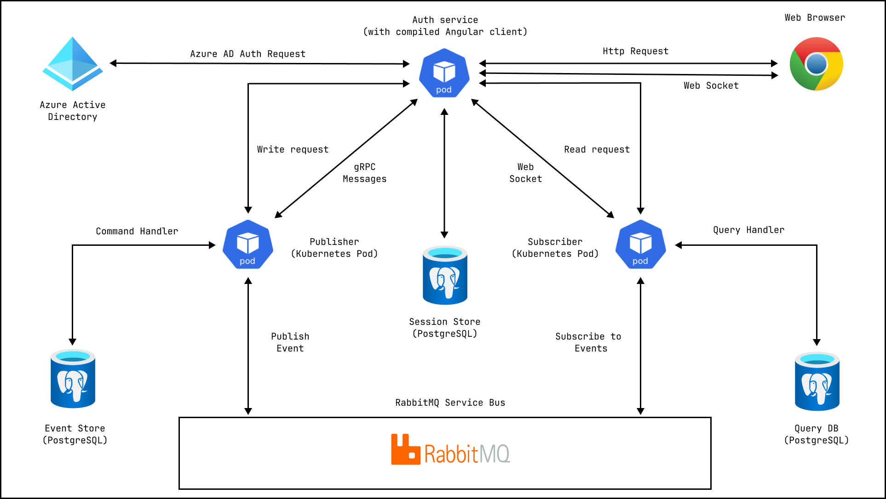
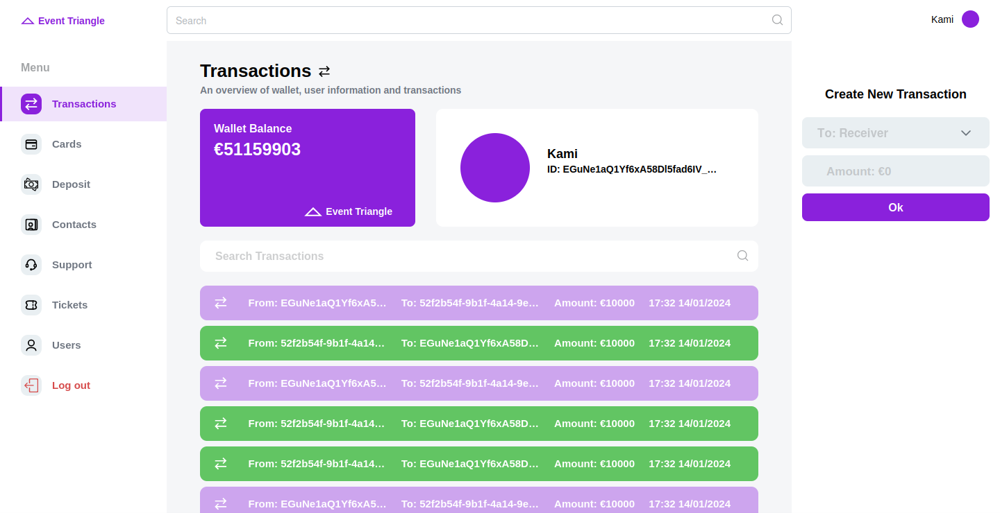
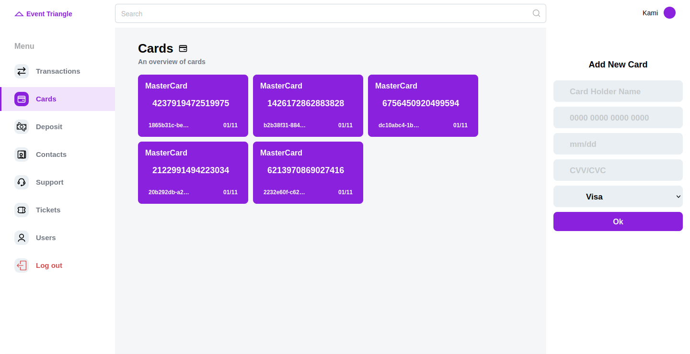
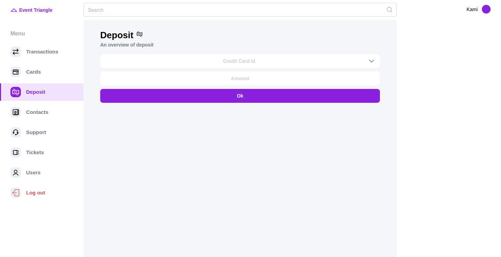
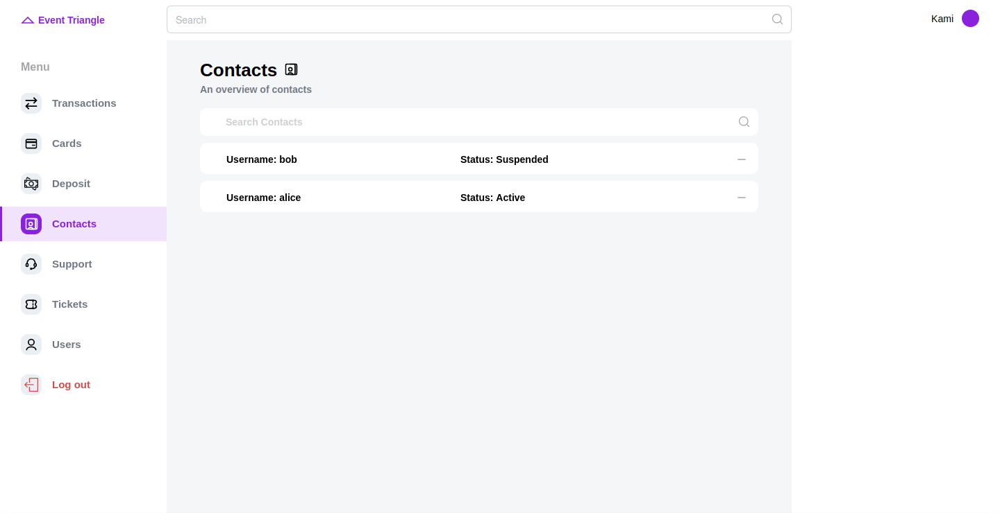
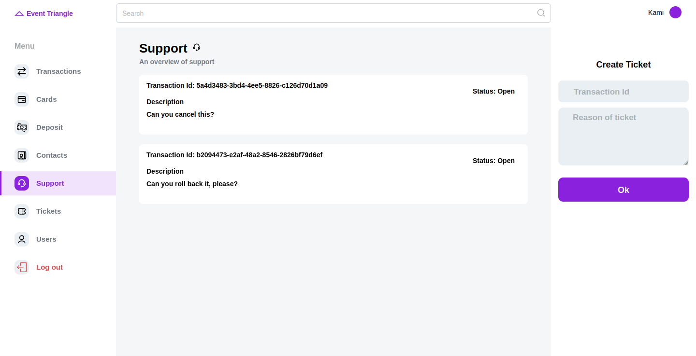
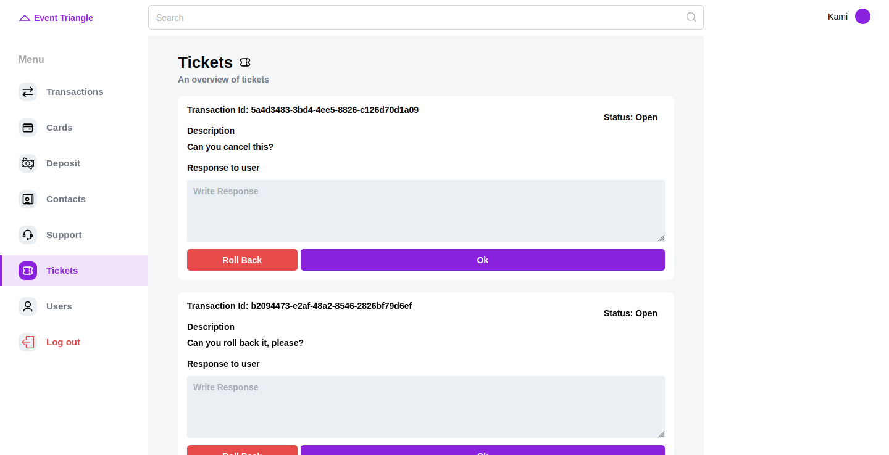
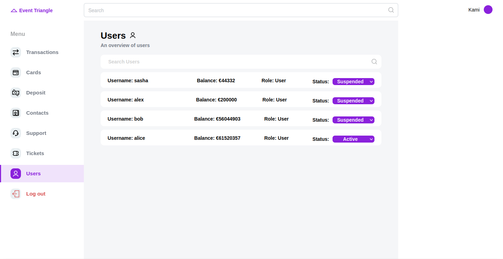

  

  <h1>EventTriangleAPI</h1>

Event Triangle is a project that leverages the power of event sourcing using
.NET and Angular frameworks to manage and track currency transactions. 
This project employs a cutting-edge approach to data storage and retrieval, capturing each state-changing event 
in the system to create a comprehensive and reliable transaction history. 
With a focus on real-time updates and seamless integration between the backend and frontend, 
EventTriangleAPI offers realtime communication using SignalR.

- **Video**: https://www.youtube.com/watch?v=9Deyui0g1RY

## Required Software

- **.NET SDK 8.0.301 or later:** https://dotnet.microsoft.com/en-us/download
- **NVM for windows:** https://github.com/coreybutler/nvm-windows
- **Angular CLI:** `15.2.6`
- **NodeJS:** `18.15.0`
- **NPM:** `9.5.0`
- **Docker:** https://docs.docker.com/get-docker/
- **IDE**: Visual Studio 2022 or JetBrains Rider

## How to run in Debug mode

### Build Angular client

- Install NVM: `choco install nvm -y`
- Install NodeJS `18.15.0` using NVM & PowerShell as Administrator: `nvm install 18.15.0`
- Use NodeJS `18.15.0` using NVM via PowerShell as Administrator: `nvm use 18.15.0`
- Check NodeJS installed properly (should be `18.15.0`): `node -v`
- Check NPM installed properly (should be `9.5.0`): `npm -v`
- Go to the project folder: `cd src/authorization/EventTriangle.Client`
- Restore node modules: `npm ci`
- Install Angular CLI globally: `npm install -g @angular/cli@15.2.6`
- Open PowerShell as Administrator and type: `Set-ExecutionPolicy -ExecutionPolicy RemoteSigned`
- Check that Angular CLI installed properly: `ng version`
- Build project for development using Angular CLI: `ng build`
- Run angular client: `ng serve`

### Run required containers

- `docker run --name "event-auth-pgsql-db" -e POSTGRES_USER=postgres -e POSTGRES_PASSWORD=postgres -p 5432:5432 -d postgres:latest`
- `docker run --name=rabbit1 -p 5672:5672 -p 15672:15672 -e RABBITMQ_DEFAULT_USER=guest -e RABBITMQ_DEFAULT_PASS=guest -d rabbitmq:3-management`

### Run .NET Services in order

1. `Authorization service`
2. `Sender service`
3. `Consumer service`

## Infrastructure diagram

## Screenshots

### Transactions

### Credit Cards

### Deposit

### Contacts

### Support

### Tickets

### Users

## Technology stack

- **SDK:** `.NET 8`
- **Frameworks:** `ASP .NET Core`, `Angular 15`
- **Persistence:**
    - Database: `PostgreSQL 15`
    - ORM: `Entity Framework Core`
- **Authorization:** `Azure AD`
- **Presentation:**
    - API Documentation: `OpenAPI (Swagger)`
    - Realtime Communication: `SignalR`
    - Frontend Development: `Angular 15`
    - Microservices communication: `RabbitMQ`, `GRPC`
- **Unit and Integration Testing:** `XUnit`, `FluentAssertions`
- **Containerization:** `Docker`, `k8s`
- **Continuous Integration:** `Azure Pipelines`, `GitHub Actions`
- **Continuous Deployment:** `Azure Pipelines`, `GitHub Actions`, `Azure DevOps`, `Azure K8s Service`
- **Programming languages:** `C#`, `SQL`, `TypeScript`
- **Tools & IDE:** `Visual Studio`, `Rider`, `VS Code`, `WebStorm`, `SMSS`, `Postman`

## Useful links

- Docker images: https://hub.docker.com/u/kaminome
- Azure DevOps project: https://dev.azure.com/EventTriangle/EventTriangleAPI

## How to run Docker compose

### Windows

- `setx EVENT_TRIANGLE_AD_CLIENT_SECRET <YOUR_AD_SECRET>`
- `docker-compose up`

### Linux

- `export EVENT_TRIANGLE_AD_CLIENT_SECRET=<YOUR_AD_SECRET>`
- `docker compose up`

## How to build docker images

From `src` folder run:

- `docker build --build-arg FRONT_API_URL="http://localhost:7000/" -t eventtriangle/auth:1.0 -f ./authorization/Dockerfile .`
- `docker build -t eventtriangle/consumer:1.0 -f ./consumer/Dockerfile . `
- `docker build -t eventtriangle/sender:1.0 -f ./sender/Dockerfile .`